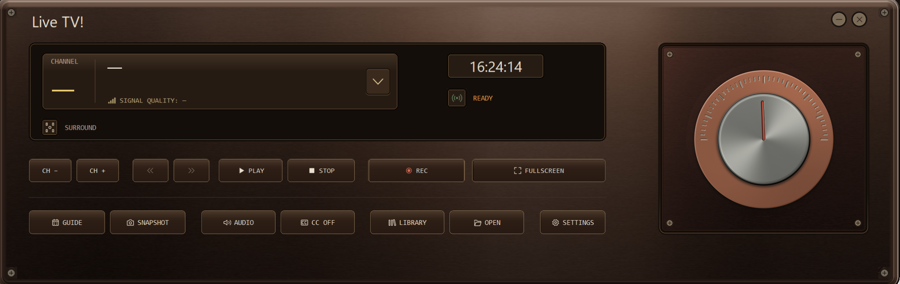
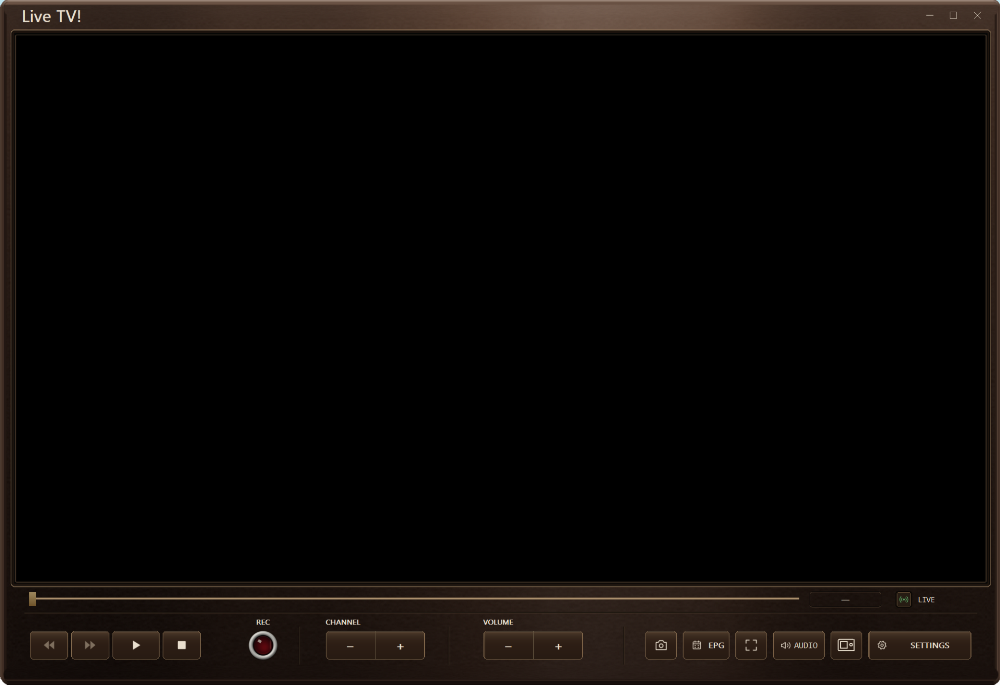

<!-- SPDX-License-Identifier: MIT — original documentation text only; see LICENSES.md. -->

<p align="center">
  
</p>

<h1 align="center">Open Volar S</h1>

<p align="center">
  <strong>A new life for the original AVerTV Volar S.</strong><br>
  A Rust-based toolkit with native Windows and Linux Live TV,<br>
  source-built firmware, diagnostics, and the native <strong>Live TV!</strong> application.
</p>

<p align="center">
  <strong>Windows 10 / 11 and Linux x86_64</strong> · <strong>Rust</strong> · <strong>0.9.5</strong>
</p>

<p align="center">
  <a href="#interface">Interface</a> ·
  <a href="#features">Features</a> ·
  <a href="#supported-hardware">Hardware</a> ·
  <a href="#getting-started">Getting started</a> ·
  <a href="#building-from-source">Build</a> ·
  <a href="#license">License</a>
</p>

---

**Open Volar S** brings the original **AVerTV Volar S (A865R)** to a modern Rust-based software stack: a userspace driver, source-built firmware, diagnostic tools, and **Live TV!**, a native Windows and Linux television application.

Watch broadcasts in a dedicated viewing window, control playback from a hardware-inspired receiver panel, record the original transport stream, browse program information, and tune the image and audio path without relying on a browser-based UI.

## Interface

### The Orbit receiver panel

The receiver panel combines channel information, transport controls, direct access to the guide and recordings, and a dedicated rotary volume control. The interface supports **Metal**, **Glass**, and **Plastic** control materials.

<p align="center">
  
</p>

<p align="center"><em>The DAC-inspired receiver panel, shown with neutral placeholders rather than a station name or channel number.</em></p>

### Live TV! viewing window

<p align="center">
  
</p>

The viewing window keeps playback, recording, channel selection, volume, snapshots, the program guide, audio controls, and fullscreen access directly beneath the video surface.

## Features

| Feature | What it offers |
| --- | --- |
| **Native Linux and Windows interface** | Rust and Windows native (GTK-3 on Linux). Although we use different toolkits for each operating system, the look and feel of the interface has been unified, and it comes with Metal, Glass, and Plastic button styles. |
| **Optimized for many scenarios** | Our interface is WSL-friendly, executing video and sound passthrough if WSL is detected. WINE is also well supported, and it has a compatibility mode for external players, such as VLC. |
| **Language support** | The interface is available in English, Brazilian Portuguese, Spanish, and Greek. |
| **Vulkan Video playback** | Hardware-accelerated H.264 decoding through Vulkan Video on supported GPUs. Windows also offers a Microsoft decoder; native Linux playback requires Vulkan Video support. |
| **Picture controls** | Deinterlacing, scaling, aspect-ratio controls, picture adjustments, and ICC color-profile support. |
| **Recording and time shift** | Preserve the original broadcast transport stream; pause, seek, and step through a growing recording, or open a saved `.ts` file. |
| **Guide and captions** | Electronic program guide and supported ISDB closed captions using information supplied by the broadcaster. |
| **Audio controls** | Broadcast track selection, stereo/mono/left/right modes, and 5.1 output when supported by the broadcast and audio device. |
| **Open tuner stack** | Rust receiver API, command-line utilities, Debug Desk, source-built firmware loaded into device RAM, and experimental BDA compatibility adapters. |

## Supported hardware

| Component | Requirement |
| --- | --- |
| **Operating system** | Windows 10 or Windows 11, 64-bit, with the required media components; or Linux x86_64. The supplied Linux binaries require glibc 2.43. |
| **Receiver** | Original AVerTV Volar S **A865R**, USB ID **`07CA:B865`**, **IT9175 revision 1**, tuner ID **`0x70`**. Other revisions are not currently claimed to be supported. |
| **Broadcast** | **6 MHz ISDB-T UHF**, with a suitable antenna and local coverage. A Brazil preset and custom scans are available. |
| **USB access** | Windows requires the project's existing WinUSB setup; Linux uses the packaged USB driver. Only one television or diagnostic client should own the tuner at a time. |
| **Graphics** | A compatible GPU and driver for the selected backend. Native Linux playback requires Vulkan Video H.264 support; Windows also offers Microsoft decoding. |

Native Windows and Linux live playback does **not** use mpv or an external FFmpeg video decoder. The Wine/WSL playback bridges still use their earlier backends, and recording export can use FFmpeg. Original broadcast captures are retained separately from any verified or repaired output.

## Getting started

1. **Prepare the receiver.** Connect the supported tuner and antenna, then close other applications using it. On Windows, verify the existing [WinUSB setup](windows/winusb/); the installer registers BDA adapters but does not create a USB binding. On Linux, install the package for the USB driver and device permissions. See [standard TV application access](docs/TV-COMPATIBILITY.md).
2. **Launch Live TV! and scan.** Build the application as described below, or use a matching binary release when available. Open **Settings → Channels**, choose the appropriate scan profile, and scan for local services.
3. **Select a service and start playback.** Choose a discovered service from the receiver panel and use **Play** to begin viewing.
4. **Tune the experience.** Use **Settings → Video** for decoder, aspect ratio, and color profile; **Storage** for recording and snapshot folders; and **Themes** for control materials.

Time shifting requires an active recording or a saved recording. Ordinary live viewing does not create a rewind buffer. Guide, caption, and audio-track availability depend on the selected broadcast.

### VLC on Linux

1. Install the updated Linux package, then close Live TV! and other tuner applications. Only one application can control the tuner at a time.
2. In VLC, open **Media → Open Capture Device** and set **Capture mode** to **TV - digital**.
3. Select the tuner, usually `/dev/dvb/adapter0`. Use its actual adapter number if you have more than one tuner.
4. Choose **DVB-T**, enter your local channel frequency in **kHz**, and set the bandwidth to **6 MHz**.
5. Click **Play**. If the frequency carries several services, choose one under **Playback → Program**.

VLC 3's capture dialog does not offer ISDB-T, so the Linux driver advertises DVB-T as a compatibility alias. When VLC selects DVB-T, the driver maps that tuning request to ISDB-T. The alias is enabled by default and changes only tuning; it does not transcode or buffer video, or enable reception of DVB-T broadcasts. See [VLC compatibility](COMPATIBILITY.md) for command-line use, program selection, and limitations. Windows BDA access is described separately in [TV compatibility](docs/TV-COMPATIBILITY.md).

## Building from source

Use Windows with the **Rust MSVC toolchain**, **Visual Studio C++ Build Tools**, and a **Windows SDK**. From the extracted repository root:

```powershell
cargo build -p a865r-tv --release --locked
.\target\release\live-tv.exe
```

To preview the interface without opening the tuner:

```powershell
.\target\release\live-tv.exe --ui-preview --profile-dir .\target\ui-preview-profile
```

The internal Cargo package is named `a865r-tv`; the application itself is **Live TV!**. The source archive includes artwork, shaders, the lockfile, and [LICENSES.md](LICENSES.md), but not compiled applications or DLLs.

See [BUILD-SOURCE.md](BUILD-SOURCE.md) for workspace builds, tests, and installer packaging.

One source archive contains both platforms. On Windows, build with `cargo build -p a865r-tv -p a865r-debug -p a865rctl -p a865r-bda --release --locked`; on Linux, use `bash build.sh`. The Windows and Linux paths share the receiver library, CLI, Debug Desk, and `Cargo.lock`.

## Project structure

| Location | Purpose |
| --- | --- |
| [`GUI/Windows/`](GUI/Windows/) | Win32 Live TV! interface, playback, graphics, audio, guide, captions, and recording. |
| [`GUI/Linux/`](GUI/Linux/) | GTK Live TV! interface, shared artwork, Selawik fonts, and embedded playback. |
| [`crates/liba865r/`](crates/liba865r/) | USB transport, tuner control, broadcast tables, and firmware support. |
| [`windows/a865r-bda/`](windows/a865r-bda/) | Experimental Windows BDA/DirectShow compatibility. |
| [`crates/a865rctl/`](crates/a865rctl/) and [`debug/`](debug/) | Command-line tools and the diagnostic application. |
| [`windows/`](windows/) and [`linux/`](linux/) | Platform drivers, applications, and installers. |
| [`firmware/`](firmware/) and [`docs/`](docs/) | Shared firmware and technical documentation. |

The [Rust API reference](docs/API.md) and [firmware documentation](docs/OPEN_FIRMWARE.md) provide more technical detail.

Development history is kept separately in [HISTORY.md](HISTORY.md).

## License

Original, independently authored Open Volar S material is additionally offered under the **MIT License**, with its scope and full text in [LICENSES.md](LICENSES.md).

The receiver also contains **GPL-3.0-only** code adapted from `recfsusb2i`, so the **combined application remains distributed under GPL-3.0-only**, as recorded in [LICENSES.md](LICENSES.md) and the workspace manifests. This is therefore not an MIT-only distribution.

Third-party code and assets retain their own terms. See [THIRD_PARTY.md](THIRD_PARTY.md) and [LICENSES.md](LICENSES.md).

## Linux port

The Linux USB driver, Rust command-line receiver tools and Debug Desk, Rust graphical DEB/RPM installer, Ubuntu 22.04–26.04 kernel compatibility checks, and WSL setup notes are in [linux/README.md](linux/README.md). The Linux GTK Live TV! interface reuses Windows artwork and runs the Rust receiver with native Vulkan Video playback. See [native Linux player requirements](docs/NATIVE-LINUX-PLAYER.md) for supported hardware and limits.

### Wine on Linux

The Linux-built 0.9.5 Windows installer configures its native Linux helper and
private authentication automatically. Install the Linux package first for driver
permissions and mpv, then install and launch normally under Wine.
See [Wine setup and requirements](docs/WINE.md).
